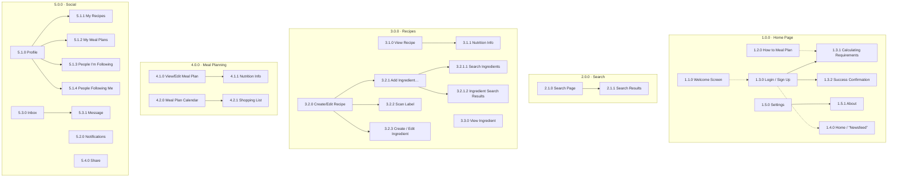

# Site Map

Reconstructed from the `Site Map` page of `Vegify.sketch` (the page titles and numbering lived in
symbol-instance overrides, which the Figma import dropped). Numbering is preserved verbatim.

**Solid edges** = hierarchy encoded by the numbering scheme. **Dashed edges** = flow arrows that
were explicitly drawn and named in the sketch (`welcome --> register/login`,
`register/login --> home/"newsfeed"`, `how to plan --> calculate requirements`). The sketch's other
connector graphics were duplicated symbols with stale names and were not treated as data.

